<div align="center">
  
  <h1>Ecode 编程实践平台</h1>
</div>

Web 前端: [ecode-vue3](https://github.com/xuanyue1024/ecode-vue3)   [ecode-vue2](https://github.com/xuanyue1024/ecode-vue)

## 一、 操作说明

### 1.1 如何安装

推荐使用Docker Compose一键部署

下载[docker-compose.yaml](./docker-compose.yaml)文件到你的服务器

把文件[application-dev-example.yml](./e-server/src/main/resources/application-dev-example.yml)改为`application-dev.yml`

在文件当前目录创建以下结构

```txt
ecode
├── config
│   │── application-dev.yml # 后端配置文件
│   └── nginx.conf # Nginx 配置
├── data # 容器数据持久化
├── sql
│   └── ecode.sql # 初始化数据库文件
└── docker-compose.yaml

```

在当前目录下执行

```shell
docker compose up -d
```

### 1.2 学生使用

#### 1. 注册与登录

使用邮箱注册账号,注册时选择学生角色，可通过WebAuthn身份认证标准进行登录（首次

使用需要通过账号密码登录后注册 webauthn)，无需密码，保障账号安全，也可使用账号密码进行登录操作。

  
<p align="center">图1 学生用户登录界面</p>

  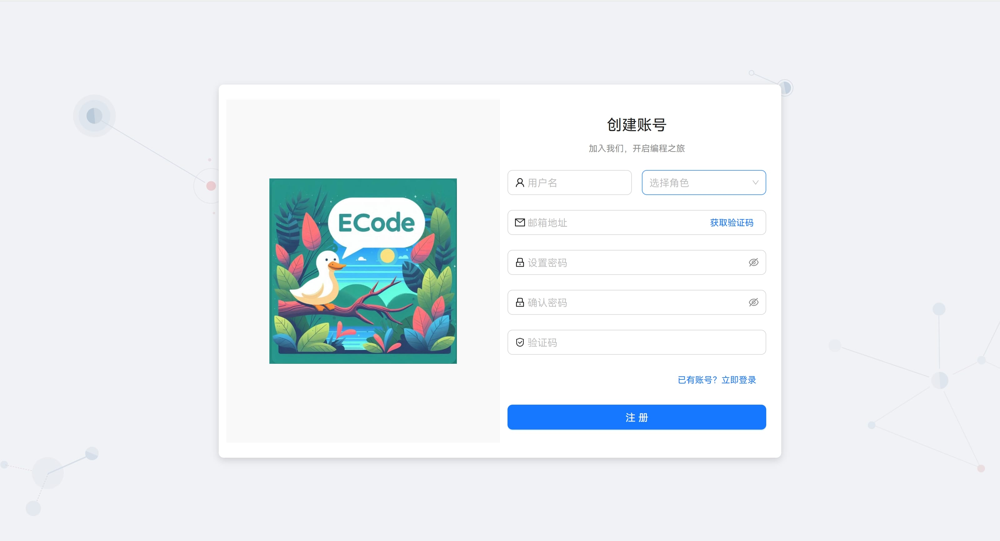
<p align="center">图2 学生用户注册页面</p>

#### 2. 个人信息修改

进入个人信息界面，可对昵称、性别、电话、地址、出生日期、邮箱等信息进行修改，其中，邮箱修改需要进行新邮箱验证，用户名、角色注册时绑定不可修改。

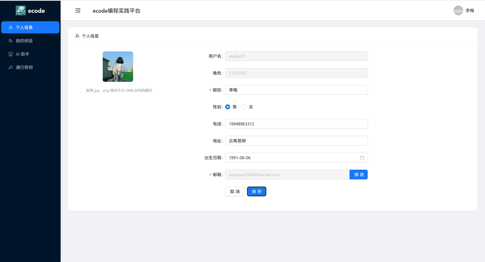  
<p align="center">图3 个人信息修改</p>

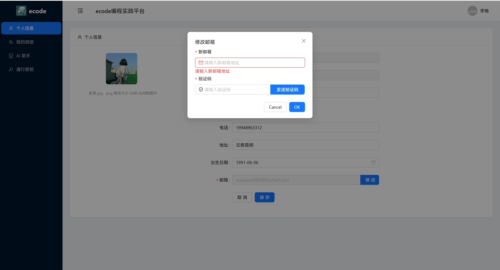  
<p align="center">图4 邮箱更换</p>

#### 3. 我的班级

学生在此可进入指定班级，要加入新班级时，点击右上角加入班级按钮输入通过老师创建班级后生成的邀请码加入相应的班级。

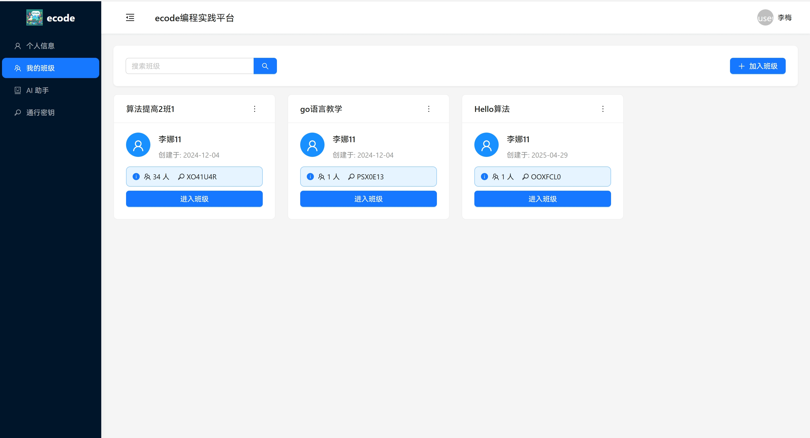
<p align="center">图5 我的班级</p>

学生从我的班级选择班级后即可进入班级详情界面。

(1)班级概览：可在班级概览中快速了解班级整体情况，可查看当前班级人数，题目数量，我的题目完成情况，题目难度和标签分布信息。

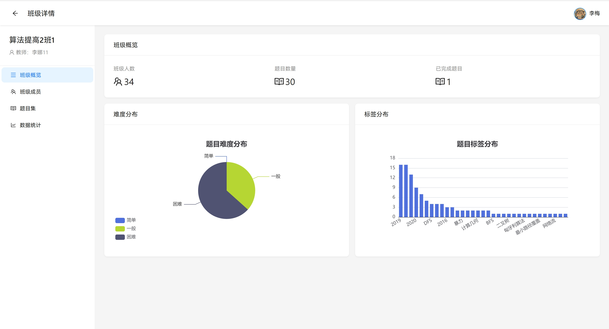  
<p align="center">图6 班级概览</p>

(2)班级成员：可查看当前班内加入的学生用户名、姓名、邮箱信息。

  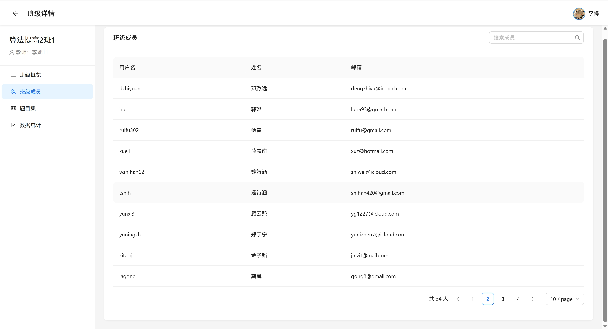
<p align="center">图7 班级成员</p>

(3) 题目集：在题目集页面查看老师添加至班级内的题目，包括题目名称、难度、标签、提交次数、通过率、完成状态等信息，选择题目开始做题或重做。

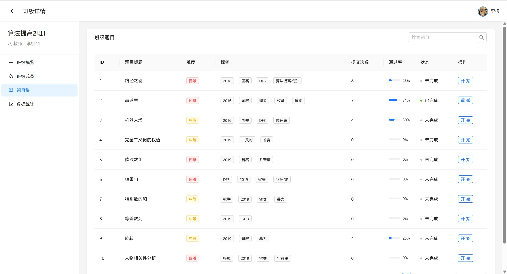  
<p align="center">图8 题目集</p>

进入答题页面：点击开始做题或重做按钮后，进入答题界面在答题页面，左侧查看题目名称、内容和难度，可根据需要点击历史图标按钮查看该题目的提交历史，包括提交语言、提交时间、通过测试数及提交历史代码等；右上方可更换编辑器主题、切换代码语言、调整字号等；选中代码右键可使用AI优化代码、修复bug、解释代码等功能；也可点击顶栏对话按钮与AI进行对话获取辅助学习帮助。

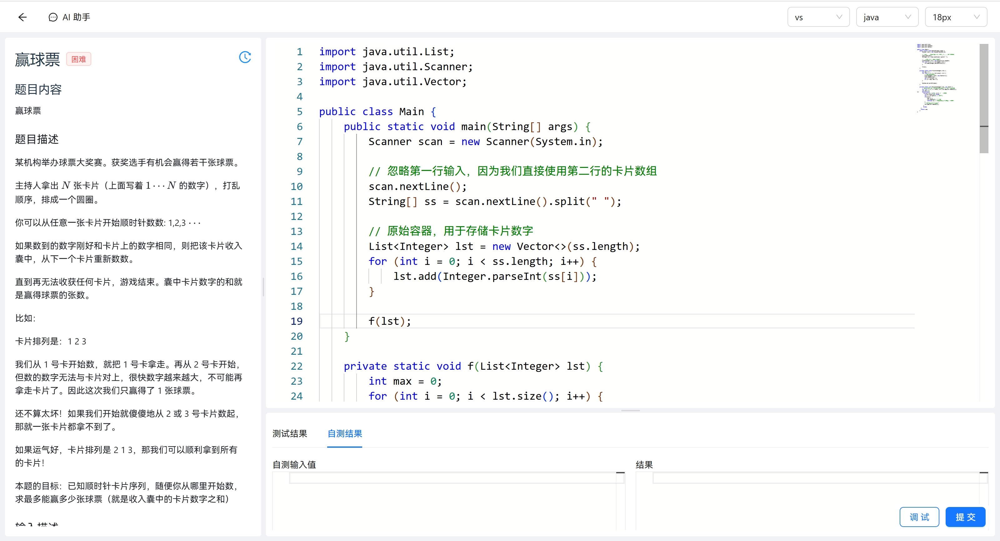  
<p align="center">图9 答题界面</p>

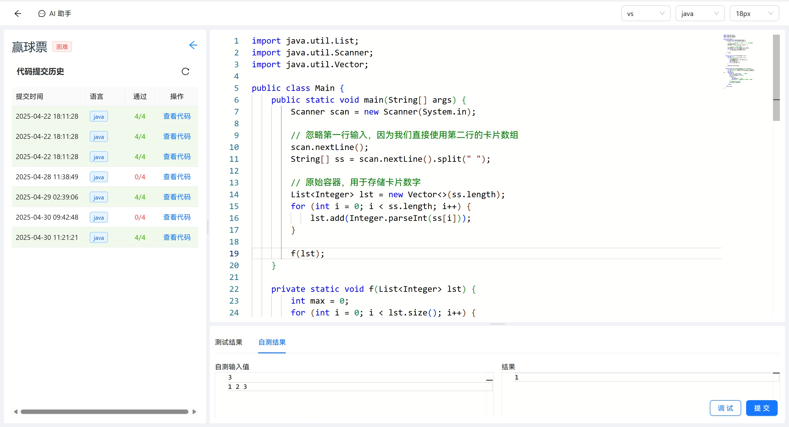  
<p align="center">图10 题目提交历史</p>

  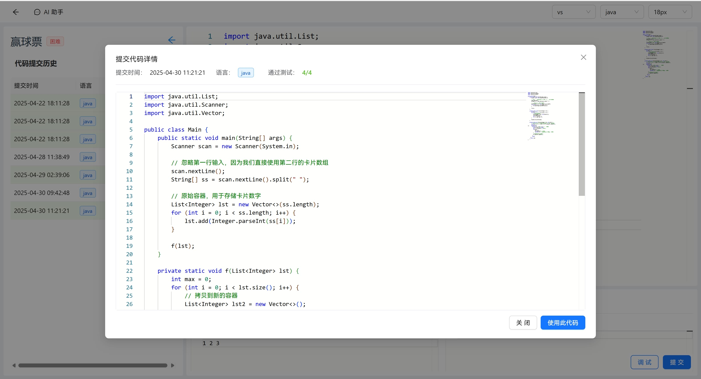
<p align="center">图11 提交代码详情</p>

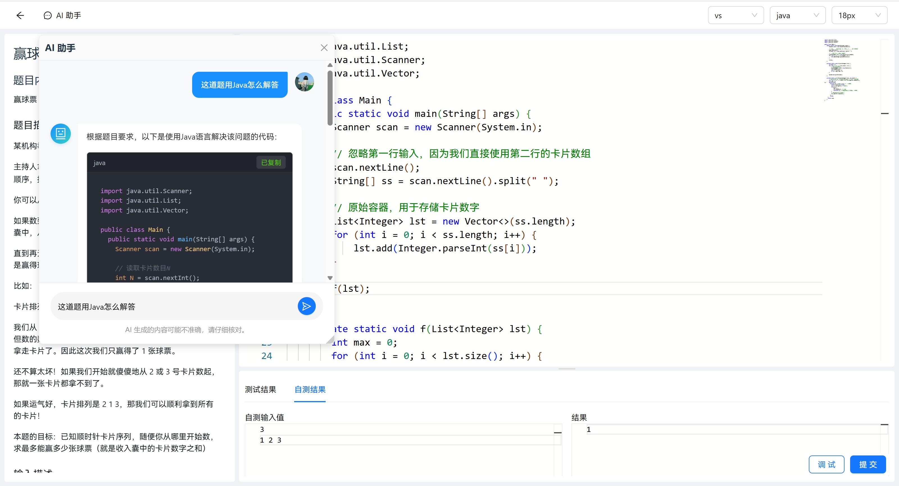  
<p align="center">图12 AI助手</p>

代码运行与调试：在输入值编辑框输入自测值，点击调试按钮，通过Docker容器化技术实现代码运行环境的快速部署和高度隔离，获得该语言代码的运行结果；提交代码后，系统通过查询数据库获取代码输入值并交给Docker容器运行，执行完毕后返回输出值，与数据库输出值进行比对，返回统一差异格式，完成评分。

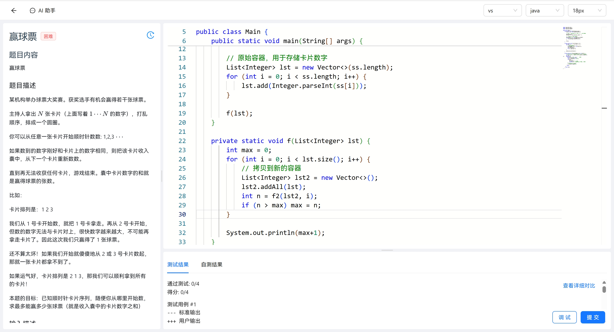  
<p align="center">图13 代码运行与调试</p>

(4) 数据统计：可查看当前学生用户在当前班级的学习情况统计，包括得分、提交次数和通过次数。

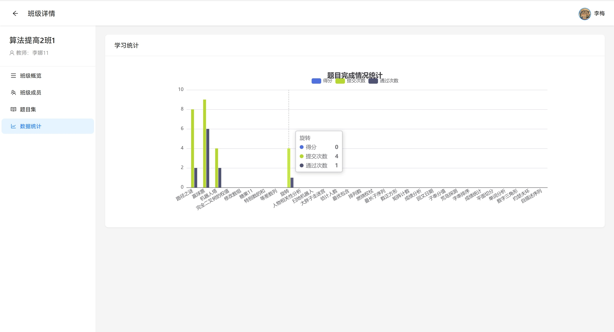  
<p align="center">图14 我的统计</p>

#### 4.AI助手

在AI会话平台中与AI进行交互，利用基于SpringAI的Tool实现AI的Function call功

能，让 AI 查询学生信息、所在班级、题目完成情况以及班级内各种标签的题目，从而获得题目推荐、题目分析等能力，辅助学习。

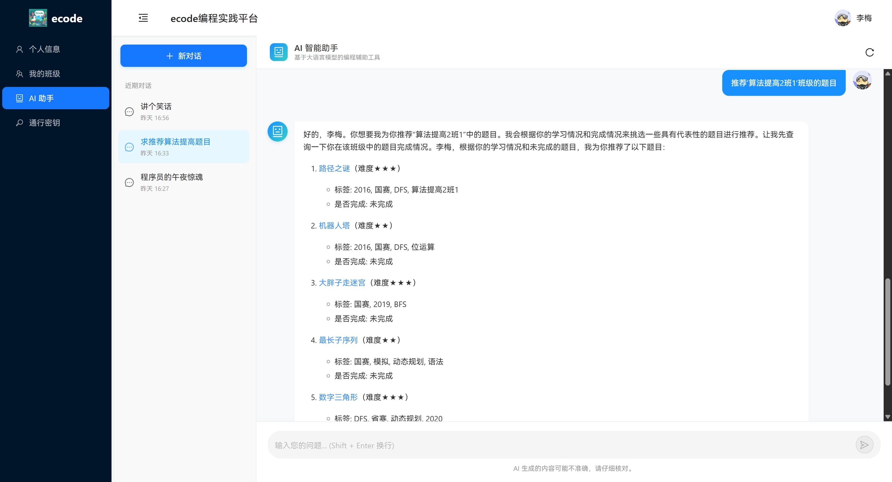  
<p align="center">图15 AI助手</p>

#### 5. 通行密钥

可在此注册通信密钥，便于登录时直接使用通行密钥一键登录，而不是使用账号密码登录。

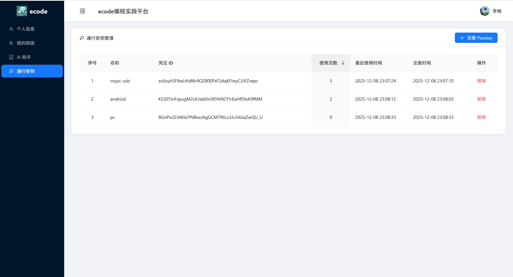  
<p align="center">图16 通行密钥</p>

#### 6. 退出登录

点击右上角头像位置，点击退出登录按钮即可退出登录。

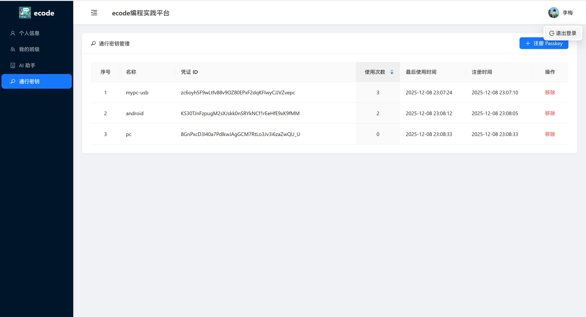  
<p align="center">图17退出登录</p>

### 1.2 教师使用

#### 1.注册与登录

注册时角色选择老师，其它与学生端功能一致。

#### 2.个人信息修改

和学生端功能一致。

#### 3.班级管理

此处展示老师添加的班级列表，展示班级的名称、邀请码、加入人数、创建时间信息，也可进行查看班级详情、编辑班级名称和删除班级操作。

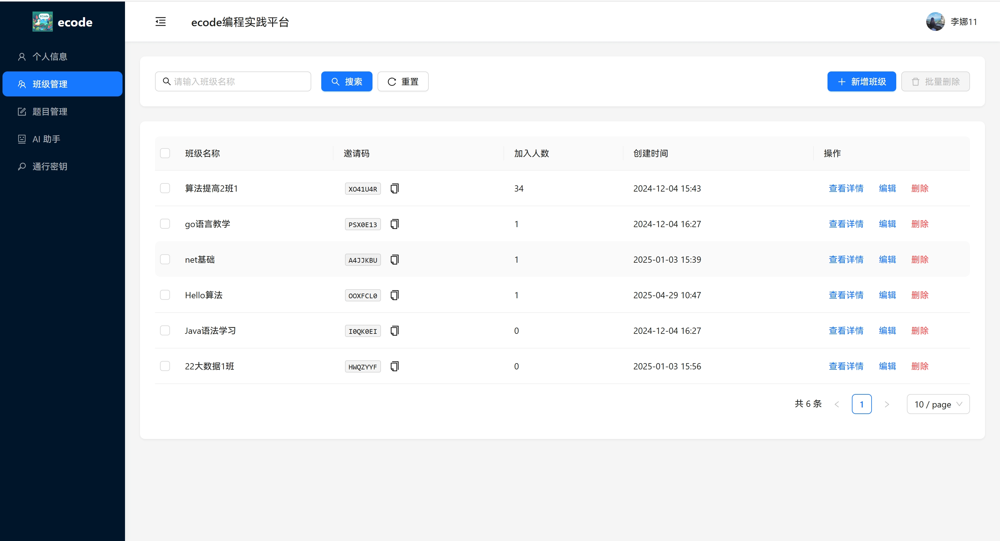  
<p align="center">图18 班级管理</p>

教师从班级管理点击查看详情即可进入班级详情页面。

(1) 班级概览：和学生端的班级概览一致。  
(2) 班级成员：查看加入班级的所有学生用户信息，包括姓名、邮箱、总得分、完成率，以及每道题目的详细情况（标题、提交次数、通过次数、得分）等，方便对学生的整体学习情况进行掌握。

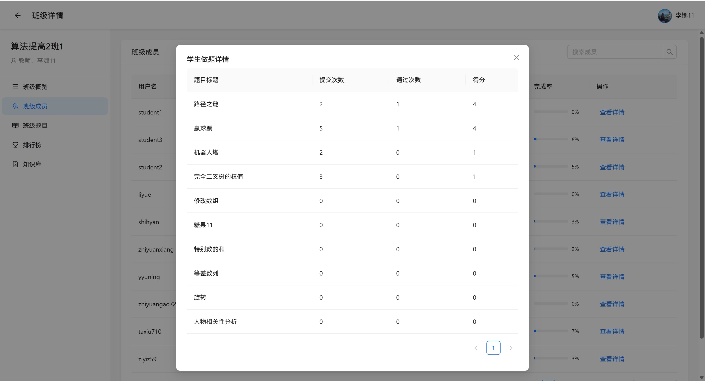  
<p align="center">图19 学生做题详情</p>

(3) 班级题目：查看所有在班内的题目，包括题目标题、难度、标签、创建时间、更新时间

等信息，支持查看与编辑功能，也可从题库中批量添加题目到现有班级。

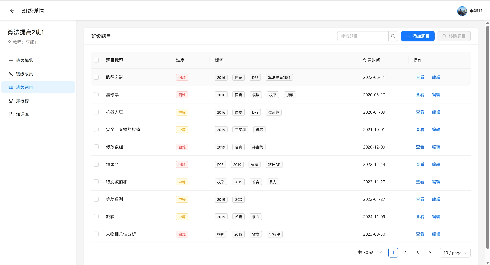  
<p align="center">图20 班级题目</p>

(4) 排行榜：进行多维度的班级学情分析，包括查看班级题目提交情况表、班级学生成绩排名、班级学生完成不同难度题目分布、班级题目通过率排行榜等信息，全面了解班级学习情况。

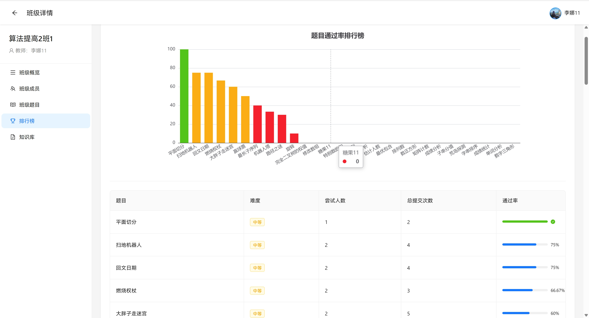  
<p align="center">图21 排行榜</p>

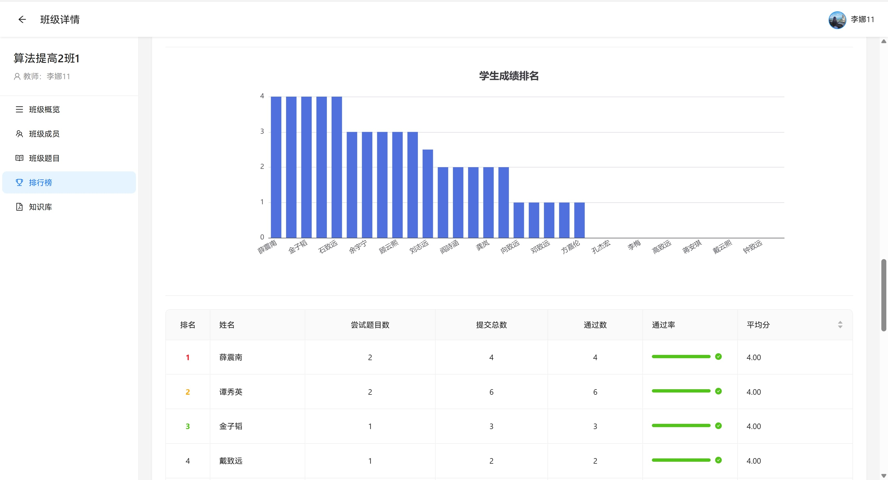  
<p align="center">图22 排行榜2</p>

(5) 知识库：每个班级可以拥有一篇 PDF 格式的知识库文档。用户上传知识库资料后，可以查看、下载或重新上传。当知识库文件上传完成后，系统会将文件按页拆分成多个片段，并通过向量大模型将这些片段转换为高维向量，以捕捉文本的语义信息。随后，这些向量化的文档片段会被存储到向量数据库中。

在问答环节中，AI会先将用户的问题输入向量模型进行向量化处理，然后通过向量数据库快速检索相似信息，最后将检索到的信息传递给文本模型，生成答案返回给用户。

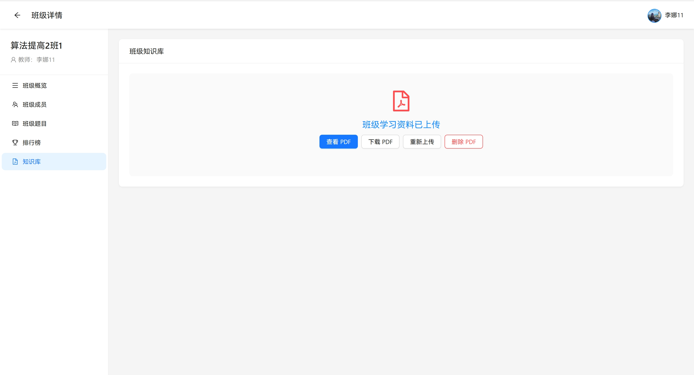  
<p align="center">图23 班级知识库</p>

#### 4. 题目管理

查看与搜索题目：可查看、搜索题目，查看题目标题、难度、标签、创建时间等信息，并进行编辑、删除操作。

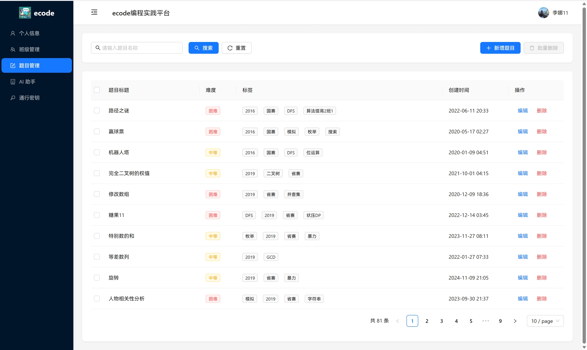  
<p align="center">图24 题目管理</p>

新增题目：用户可自行添加题目标题、难度、标签、题目描述、解答、测试用例等信息；也可将要求发给 AI，一键生成包括标题、难度、标签、题目描述、解答、测试用例在内的题目内容。

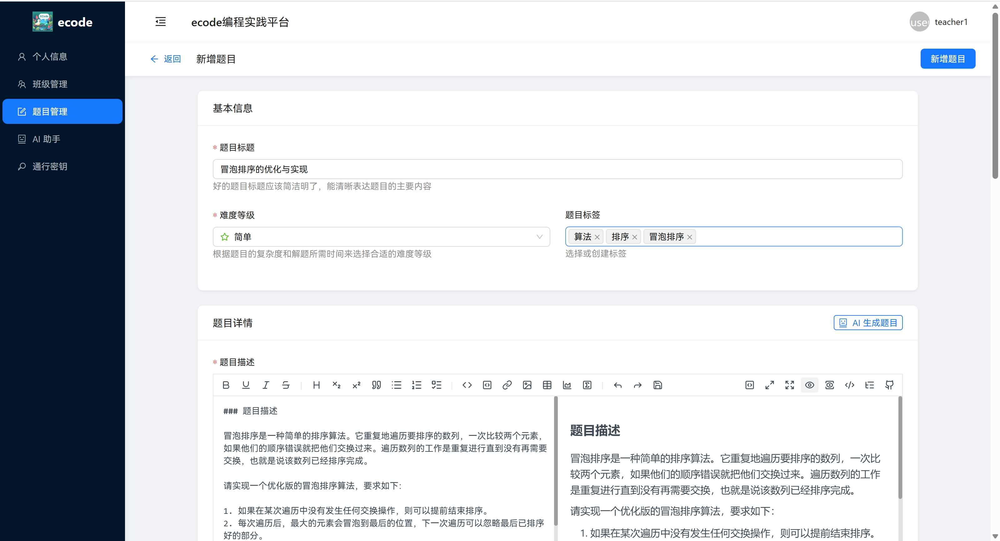  
<p align="center">图25 新增题目</p>

#### 5.AI助手

老师可以询问AI，进行题目咨询，内容优化，提高工作效率。

#### 6. 通行密钥

与学生端一致。

#### 7. 退出登录

与学生端一致。

### 1.3 关键技术

平台使用 Spring AI 工程应用框架，兼容所有知名 AI 模型平台接口。

#### 3.3.1 RAG大模型知识库

在班级详情的知识库页面中，每个班级可以拥有一篇PDF格式的知识库文档。用户上传知识库资料后，可以查看、下载或重新上传。当知识库文件上传完成后，系统会将文件按页拆分成多个片段，并通过text-embedding-v3向量大模型将这些片段转换为高维向量，以捕捉文本的语义信息。随后，这些向量化的文档片段会被存储到向量数据库中。

在问答环节中，AI会先将用户的问题输入向量模型进行向量化处理，然后通过向量数据库快速检索相似信息，最后将检索到的信息传递给文本模型，生成答案返回给用户。

##### 涉及技术：

1. PDF文档处理：将知识库文档按页拆分成多个片段；  
2. 向量化处理：使用 text-embedding-v3 向量大模型将文本片段转换为高维向量；  
3. 向量数据库：存储向量化后的文档片段；  
4. AI检索问答：系统会将用户问题向量化，通过向量数据库检索相似信息，再由文本模型生成答案。

#### 3.3.2 AI用户个性化推荐机制

基于Spring AI的Tool实现AI的Function call功能，允许AI大模型与外部工具、API或系统进行交互，触发指定的预定义函数或工具。在本项目中，AI可通过Function call查询学生信息，所在班级，以及题目完成情况以及班级内各种标签的题目，学生通过与AI进行交互获得题目推荐，题目分析等能力。

系统通过采集学生的题目特征信息，如完成情况、知识水平、常见错误习惯等。随后，对学生的答题记录、错误率、完成情况等行为数据进行深入分析，全面刻画其学习状态和薄弱环节。

与此同时，系统对题库中的每道题目进行多维度标签化处理，包括难度等级、所涉及的知识点、题型类别、易错点等。最终，系统通过将学生画像与题目标签进行智能匹配，实现对练习题的精准推荐，帮助学生有针对性地巩固知识、提升能力。

#### 3.3.3 AI会话持久化记忆

项目基于Spring AI框架，通过实现ChatMemory接口并集成Redis存储，构建了高性能的对话上下文持久化方案，实现了AI服务的多轮对话记忆能力，显著提升了交互体验的连贯性和个性化程度。

系统在与用户的多轮对话中，持续记住对话上下文、用户偏好、历史问题和交互信息，从而实现更加自然、连贯、个性化的交互体验。让 AI 不再是“健忘”的机器人，而变成一个“有记性”的学习伙伴。

#### 3.3.3 AI个性化题目生成

在教师题目生成场景中，AI大模型通过精细化的提示设计与结构化输出约束，高效生成高准确性、教育适配性强且难度可控的题目。系统依据教学目标和学生群体的知识水平自动调整题目的类型与难度，确保生成的题目不仅覆盖指定知识点，还符合预定义的标准格式，满足不同学习阶段的需求。

#### 3.3.4Docker 容器化代码运行技术

构建多种运行环境基础镜像基础镜像，支持 Java、Python、 $\mathrm{C}++$  等主流编程语言的编译器和运行时环境；

利用通过运行多个单独镜像环境，实现进程、网络、文件系统的隔离，保证不同用户代码的运行互不干扰，程序对容器运行时间存在限制，超时返回响应并异步销毁容器，确保资源的精准利用；

通过Docker容器化技术，实现了代码运行环境的快速部署和高度隔离，彻底杜绝用户通过给运行代码输入恶意代码破坏平台运行系统的可能；

通过Cgroups技术对容器的CPU、内存、磁盘IO等资源进行精确限制，防止资源滥用；

利用管道技术实现标准输入输出重定向，建立代码运行结果采集和错误处理体系。

#### 3.3.5 WebAuthn 身份认证技术

在本项目中，使用了WebAuthn身份认证技术。它利用公私钥加密，用户登录后可在秘钥注册页面通过设备生成公私钥对，公钥传至服务器存储，私钥留存在用户设备。登录时，服务器发送随机挑战，用户设备用私钥签名后返回，服务器利用公钥验证身份。

该技术优势明显，安全性高，杜绝密码泄露风险，能有效防止网络钓鱼等攻击；便捷性好，用户无需输入密码，通过指纹、面部识别等生物识别或USB密钥等方式，快速完成身份认证；它还支持多设备，如手机、电脑等，用户可依使用习惯选择，提升体验，为用户安全便捷认证方式，契合项目对账号安全便捷登录的需求，且未强制要求传统密码，保有密码登录，满足不同用户需求。


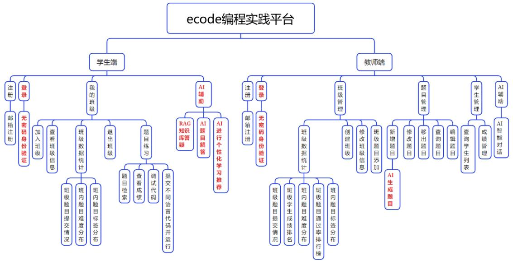

<p align="center">图26 系统功能模块图</p>